# Summary
IoTProxy Class - intended to be the simplest possible messaging code between Ignition, IoT Hub, and IoT Central

Code is far from best practice, but is based on the more complete samples from:
 * https://github.com/Azure/azure-iot-sdk-csharp/tree/main/iothub/device/samples/solutions/PnpDeviceSamples
 * https://github.com/Azure/azure-iot-sdk-csharp/tree/main/iothub/device/samples/solutions/PnpDeviceSamples/Thermostat

The intent is that this be a simplified version for convenient messaging and testing, with the above references repersenting a more capable implementation compatible with naming and flow in this sample. 

## Setup
This repo presumes that an environment exists with the following services set up (links for guidance on those pieces if you're not there yet):
1. Ignition - either Linux or Windows, doesn't matter (https://docs.inductiveautomation.com/display/DOC81/Startup+Guide)
    - Set up an OPC UA Device with the Programmable Device Simulator: (https://docs.inductiveautomation.com/display/DOC80/Programmable+Device+Simulator)
    - For the program I've used for testing, see my sample file: (<a href='./SamplesAndTemplates/IgnitionProgram.csv'>IgnitionProgram.csv</a>)
2. Ignition Azure Injector (https://docs.chariot.io/display/CLD80/Getting+Started%3A+Azure+Injector+Quick+Start)
3. Azure IoT Hub (https://learn.microsoft.com/en-us/azure/iot-hub/iot-hub-create-through-portal)
4. Azure IoT Central, with an empty Application (https://learn.microsoft.com/en-us/azure/iot-central/core/howto-create-iot-central-application)

Given the above environment, there are a number of things to configure:
1. Azure IoT Central - Device Template
2. Azure IoT Central - Device
3. Azure Function

### Azure IoT Central - Device Template
Create the device template using an IoT Device type:
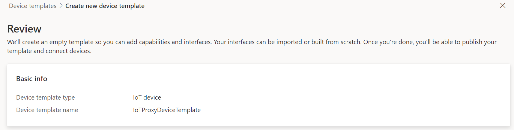
You can create a DTDL from scratch or use <a href='./SamplesAndTemplates/DeviceTemplate.json'>my sample</a> which aligns to the naming and telemetry fields used elsewhere in this repo. It shouldn't really matter what sort of telemetry you send, and you can just leave the DTDL blank (no Capabilities) for now if you don't know yet what you want to pass in.
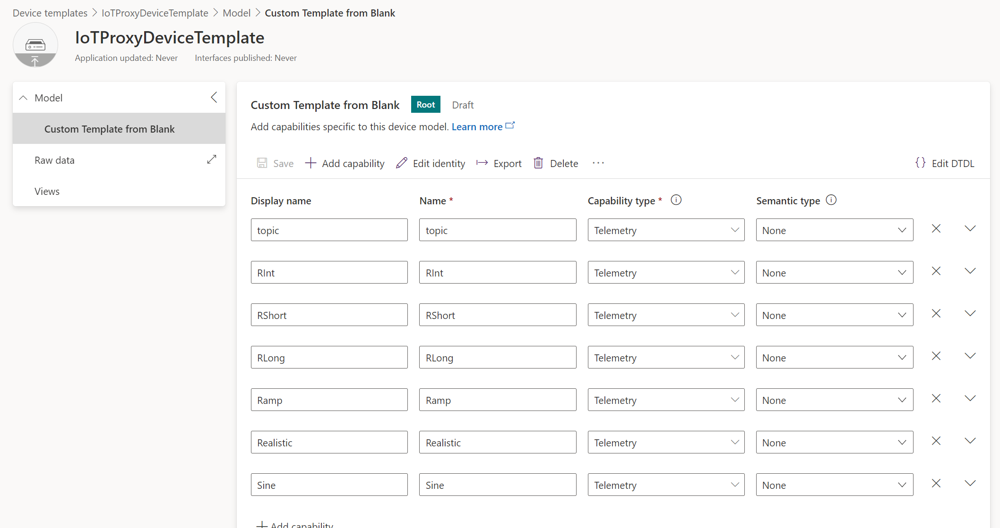
If you're adding capabilities at this point then it's helpful to click on the Views button on the left and have it generate the default views for you.
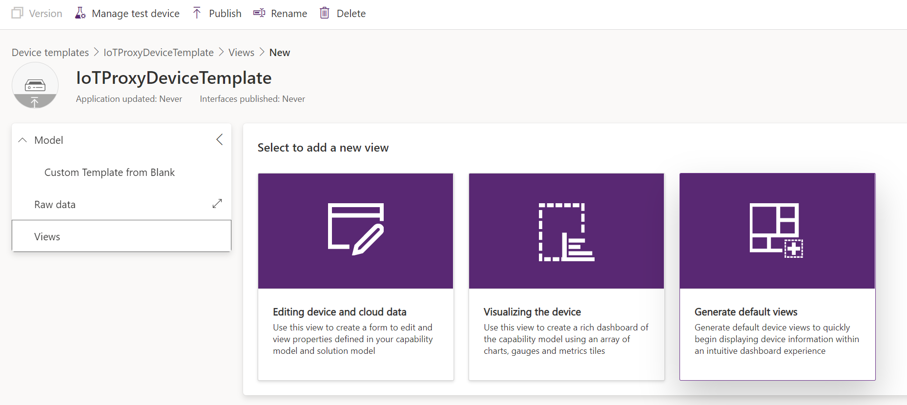
Then publish the device template so that you can assign it to the device you'll create next.
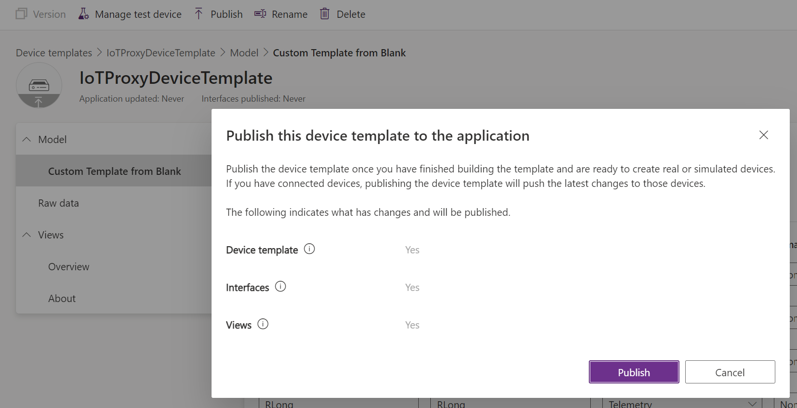

### Azure IoT Central - Device 
Create a new device from the Devices page by clicking on New or Add:
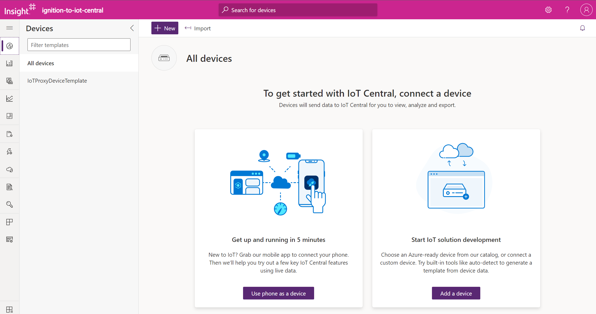
Then fill in the properties of the new device. I'm leaving the supplied value for the Device Id, but you can customize if you want. Make sure to select the template created above.
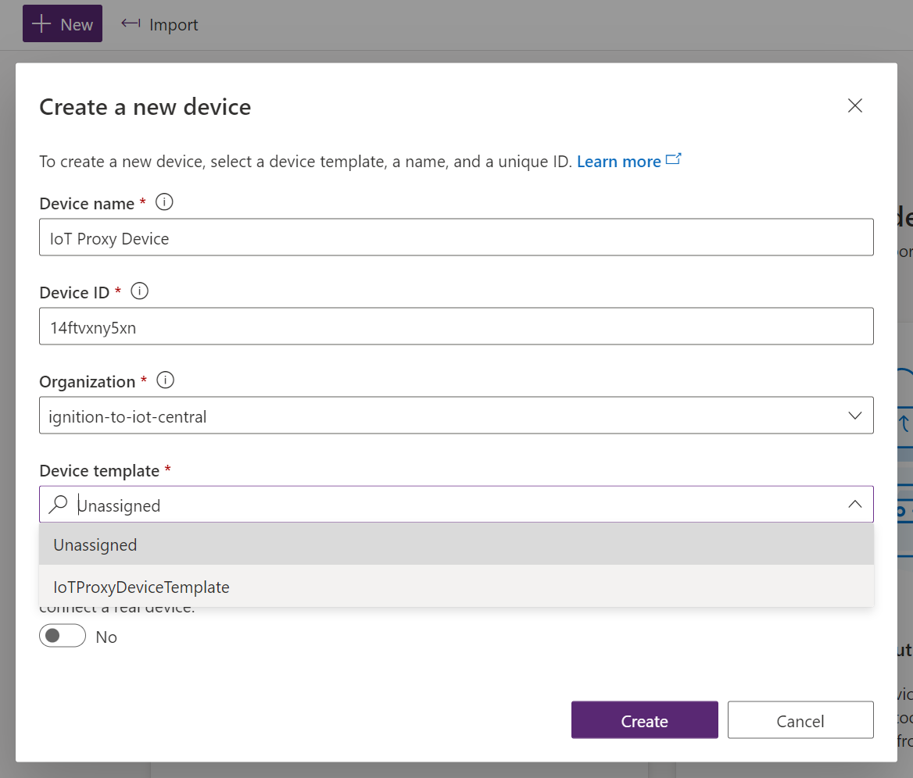
Once created the new device will appear in the Devices list.
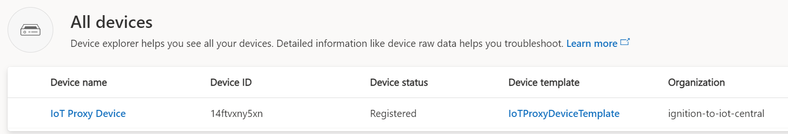
Click on the new device and click the Connect button to see the extended connection properties which we'll need to update code in the next section.
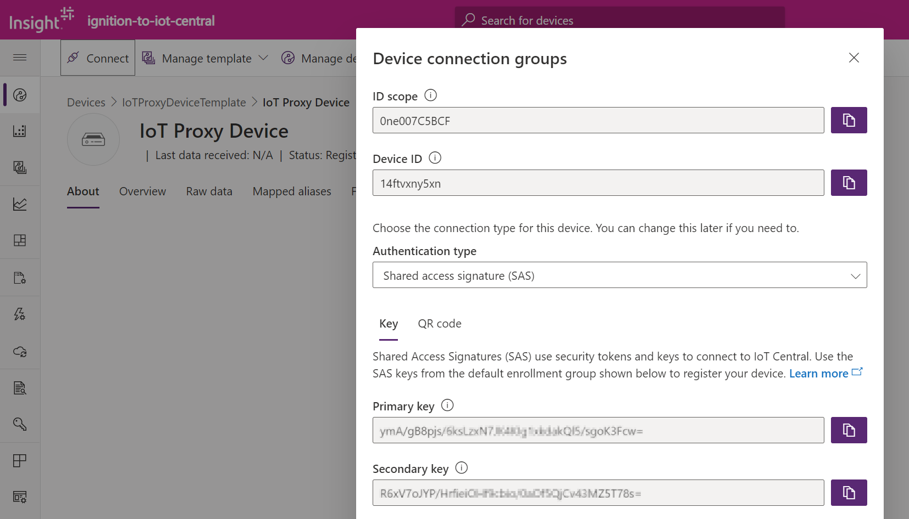

### Azure Function
In the IoTProxy.cs file make the following updates, using values from the Device connection groups dialog above:
1. Update the Parameters object initialization, editing the values to refer to values from the dialog: 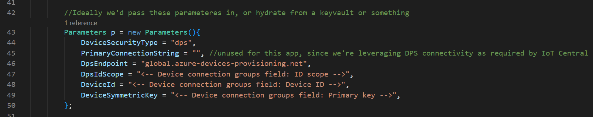
2. Update the MODEL_ID constant, which you'll have to grab from the dtdl, where it is found under the **@id** value. Either use the one from the file you imported, or visit the DTDL edit page to get it from there. 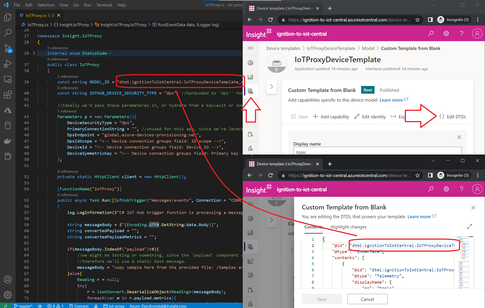
3. Lastly, update the connection string in the local.settings.json file to use the Event Hub-compatible endpoint from the IoT Hub: 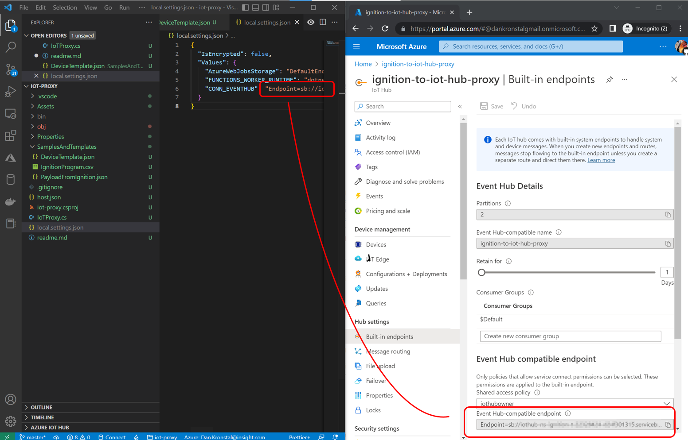
4. Once code updates above are applied, you can create a function app and add this function to the app using the basic instructions here: https://learn.microsoft.com/en-us/azure/azure-functions/create-first-function-vs-code-csharp
   - You'll have to add an app setting for the connection string with the same setting name and value as updated in step 3 above.

## Testing
Once your function is deployed and running, and with Ignition configured with the OPC UA device client sending messages through the Azure Injector to the IoT Hub, you'll be able to see the message payloads arriving on the IoT Hub as they are captured by the Function and transposed:
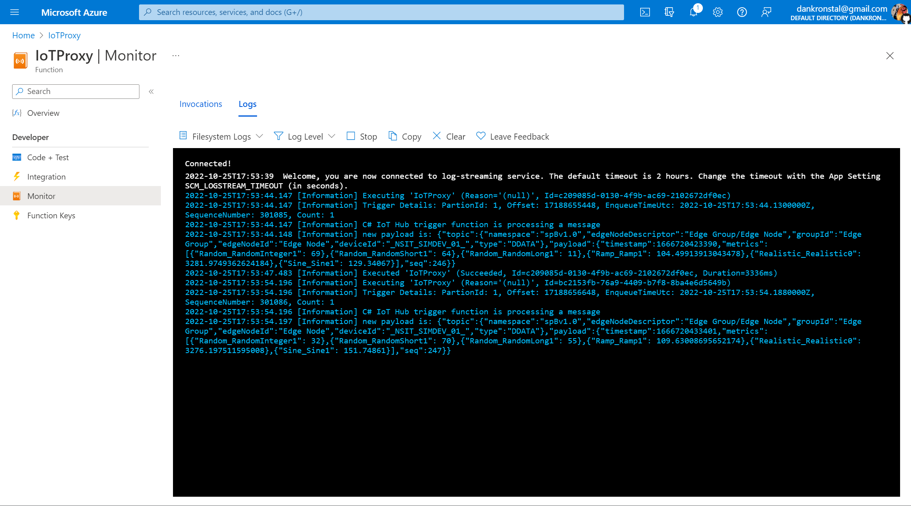
These newly shaped messages will be delivered to IoT Central using the device connection parameters used when the Function code was edited above, and so you'll see them arrive on the Device through the Raw Data view:
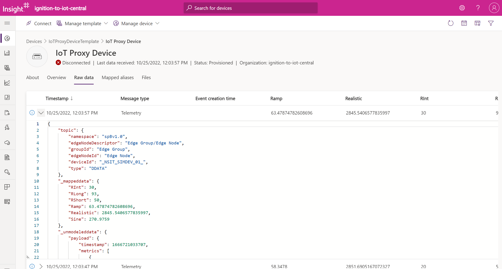
You will observe that telemetry fields explicitly mapped with an alias are given columns to display their value, and that the whole payload is itself still represented as unmodeled data, as it has not been separately mapped.
If you have created an Overview view (or other visualization of received data) then you may view that from the Device screen, and further may use the configured Capabilities for viewing telemetry message in Dashboards or other areas:
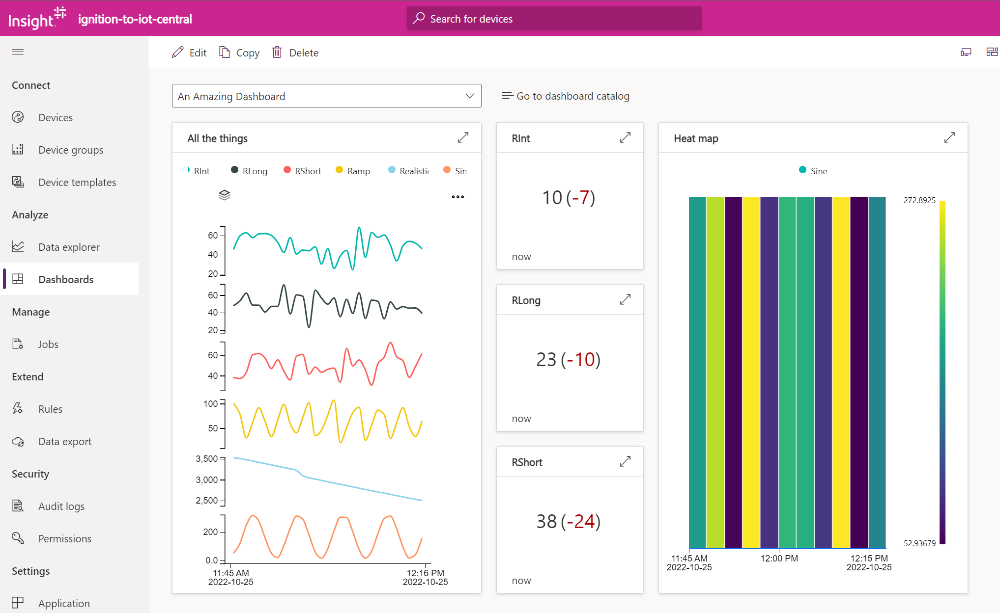
